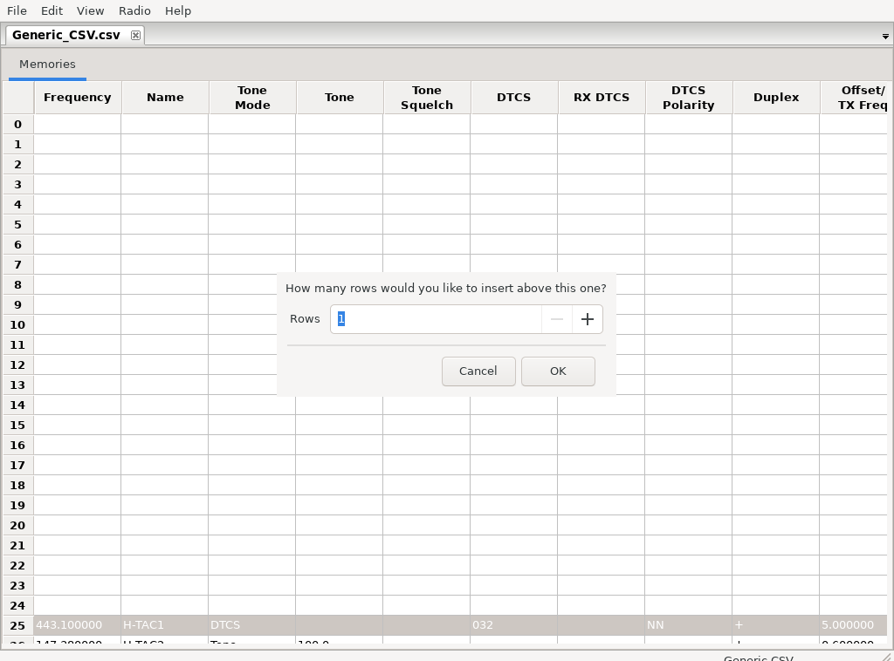
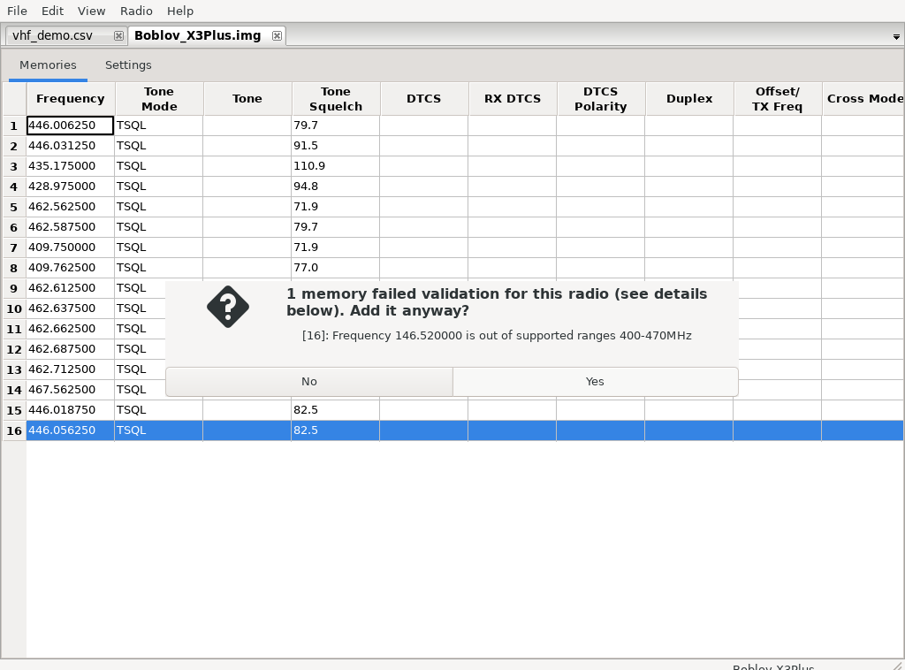
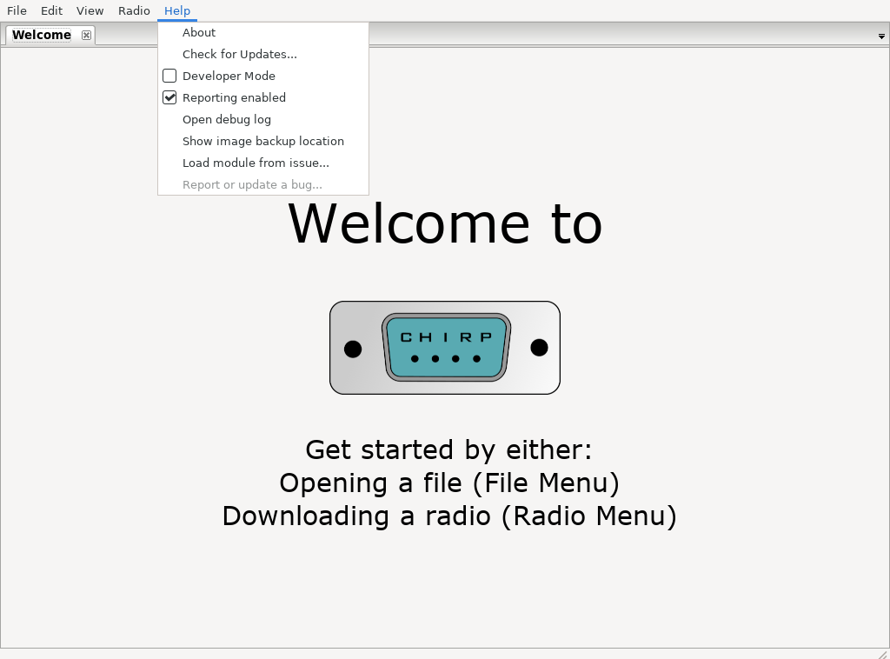

# CHIRP Project

<p align="center">
  
</p>

This is the official git repository for the
__[CHIRP](https://www.chirpmyradio.com)__ project.

When submitting PRs, please see [this file](.github/pull_request_template.md)
for rules and guidelines.

## Getting started

### 1. Clone the repo

```
git clone https://github.com/ddavis83864/chirp.git
cd chirp
```

### 2. Launch CHIRP

Pick whichever of these is easiest for you:

- **Linux, no setup required:** skip cloning entirely and just download a
  prebuilt [AppImage release](../../releases) — see
  [AppImage builds](#appimage-builds) below.
- **Linux, from this checkout:** run [`./run-chirp.sh`](run-chirp.sh) from
  the repo root. On first run it creates a local `.venv` and installs
  everything needed; subsequent runs just launch CHIRP.
- **Windows, from this checkout:** run
  [`.\run-chirp.ps1`](run-chirp.ps1) from a PowerShell prompt in the repo
  root. Same idea — first run sets up a `.venv`, later runs just launch.
  (Needs [Python](https://www.python.org/downloads/) 3.11 installed; see
  the script's comments for why that version specifically.)

Both launcher scripts are documented in more detail under
[`run-chirp.sh` / `run-chirp.ps1`](#run-chirpsh--run-chirpps1) below.

## Features added in this fork

On top of upstream CHIRP, this fork adds several memory-editor
quality-of-life features, plus a convenience launcher script and Linux
AppImage packaging (see below).

### Column hiding, reordering, and custom columns

Right-click any memory list column header (or use View > Choose Columns...)
to hide columns you don't care about, or show columns that were previously
hidden. Columns can also be reordered by dragging their headers. Both the
hidden set and the order persist across sessions.

You can also add your own scratch column (View > Add Custom Column..., or
the header right-click menu) for personal notes, sorting, or triage — it's
session-only: not saved to the radio or the file, not validated, and not
part of undo. It disappears when the tab is closed.


### Word-wrapped Comment column

The Comment column wraps long text across multiple lines instead of
scrolling off as one long line, both when viewing and when editing in place
(View > Word-wrap Comment column to toggle). Rows grow individually to fit
their own comment.


### Insert multiple rows at once

Right-click a memory row and choose Insert Rows Above... to insert more than
one blank row in a single action — you're prompted for how many, instead of
always getting exactly one. Inserting 5 rows is tracked as a single undo
step, same as inserting 1.



### Find Duplicate Memories

Edit > Find Duplicate Memories... lets you choose which fields (frequency,
tone, offset, etc.) define a "duplicate," then shows the matching groups so
you can delete them — defaulting to keeping the lowest-numbered memory in
each group.


### Option to paste incompatible memories anyway

Pasting or drag-importing memories that don't fit the destination radio (an
out-of-band frequency, an unsupported mode/tone/duplex, etc.) used to be
silently rejected, with only an after-the-fact notice listing what didn't
make it in. You're now asked "N memories failed validation for this radio
... Add them anyway?" — choosing Yes pastes them in as-is despite the
validation failure; choosing No preserves the old behavior.



### Editable, savable network query results

Memories downloaded from a query source (RepeaterBook, RadioReference,
DMR-MARC, przemienniki.net/eu, mapy73.pl, Radio Amateur Satellites, SatNOGS)
used to be read-only with no way to save them — the only workaround was
exporting to CSV and reopening that file. They're now editable directly in
the grid, and saving an unsaved query result prompts for a CSV filename and
transparently swaps the tab to the newly-saved file.

### RepeaterBook distance in miles

The RepeaterBook query dialog's Distance field is now in miles (matching
RepeaterBook.com's own site and most of its US/Canada audience) instead of
kilometers; it's converted internally as needed. Other query sources
(przemienniki.net/eu) keep their km-based distance field.


### Manual "Check for Updates" instead of automatic

CHIRP used to check chirpmyradio.com for a newer version automatically at
every startup. This fork removes that automatic check entirely — use
Help > Check for Updates... to check on demand instead. Unlike the old
automatic check, the manual one always tells you something: a "new version
available" prompt, or an explicit "you're running the latest version"
message if there's nothing new.



### Customize Menus

Help > Customize Menus... opens a tabbed dialog — one tab per top menu
(File, Edit, View, Radio, Help) plus a "Memory list (right-click)" tab for
the memory grid's context menu. Uncheck anything you never use to hide it;
changes take effect immediately, and a "Show All" button resets everything
back. Hidden items are remembered across restarts. Undo/Redo and the
Customize Menus item itself are always shown, since they're not worth the
edge cases of hiding.


### Configurable memory color coding

The memory list can color-code rows (or just selected columns) by what a
memory is: amateur repeater vs. simplex vs. calling frequency, GMRS, FRS,
MURS, marine, aviation, railroad, public safety, business/industrial,
NOAA weather, and more, plus operational states like disabled/skipped,
receive-only, and (optionally) invalid. It's on by default; everything
about it lives under View > Customize Colors... and View > Enable Memory
Color Coding / Show Color Legend.

Amateur-radio memories get finer-grained categories than a single "ham"
color: repeater, simplex, national/regional calling frequency, satellite,
APRS/data, digital voice (DMR/D-STAR/System Fusion/P25), propagation
beacon/weak-signal specialty, receive-only, and general/unclassified.
Repeater vs. simplex is determined from duplex/offset, not from whether a
tone is set, so a repeater with no tone configured still shows as a
repeater. Classification follows a fixed precedence — invalid (opt-in) >
disabled/skipped > your custom rules > emergency/calling >
specialized amateur operation > plain service membership > receive-only >
unknown — so a given memory's color is always deterministic and
explainable.

Every category's colors (background, text, bold, enabled/disabled) are
yours to change, and you can add your own rules matching frequency,
service, duplex, mode, tone, name, comment, skip state, and more, each
with its own color and priority. Color profiles export/import as JSON for
sharing or backup. Nothing about this feature is written into radio
memories, image files, CSV exports, or uploaded to a radio — it's
CHIRP-local display metadata only.

These categories are a visual convenience aid, not a legal or regulatory
determination — frequency allocations vary by country, license class, and
local band plan, and change over time. You remain responsible for
verifying your own frequencies and operating privileges.

### `run-chirp.sh` / `run-chirp.ps1`

Convenience launchers for running CHIRP straight from a git checkout, without
a system-wide install.

- [`run-chirp.sh`](run-chirp.sh) (Linux): creates a local `.venv` (with
  access to system wxPython) on first run and installs CHIRP into it, then
  launches `chirpwx.py`.
- [`run-chirp.ps1`](run-chirp.ps1) (Windows): creates a `.venv` using Python
  3.11 (the version wxPython 4.2.x ships prebuilt wheels for), installs
  `requirements.txt` (wxPython separately, wheel-only, so pip never tries to
  compile it), then launches `chirpwx.py`. Supports `-Cli` to launch `chirpc`
  instead, and `-Reinstall` to rebuild the venv from scratch.

## AppImage builds

This fork can produce a self-contained Linux AppImage of CHIRP, so people
with access to this repo can run it without setting up a Python/wxPython
build environment themselves.

**Getting a build:** every push of an `appimage-vX.Y.Z` tag (e.g.
`appimage-v1.7.0`) triggers the
[AppImage workflow](.github/workflows/appimage.yml), which builds the
AppImage and attaches it to a matching [GitHub Release](../../releases) on
this repo. Download the `CHIRP-*-x86_64.AppImage` asset from there,
`chmod +x` it, and run it. Releases follow semantic versioning — see
[CHANGELOG.md](CHANGELOG.md) for what changed in each one and what the
version numbers mean.

**Config is isolated from other CHIRP installs:** by default CHIRP stores
its settings in `~/.chirp`, shared by any install on the host (native
package, source checkout, another AppImage, etc.) — so a setting like
Help > Developer Mode enabled in one carries straight over to the others.
This AppImage instead defaults to its own `~/.chirp-appimage`, so it always
starts from CHIRP's real defaults (developer mode off, no "Browser"/"Info"
tabs) regardless of what's already set elsewhere on the host. Pass
`--config-dir /path` yourself if you want it to share state with another
install instead.

**Building one yourself:**

```
./appimage/build.sh
```

This must run on an x86_64 Ubuntu 22.04 (jammy) host — a real machine, VM,
or a `ubuntu:22.04` Docker container all work. It installs its own build
dependencies (via `sudo apt-get`) and writes the result to
`appimage/out/CHIRP-<version>-x86_64.AppImage`. You can also trigger a build
without tagging anything, via "Run workflow" on the
[Actions tab](../../actions/workflows/appimage.yml) (`workflow_dispatch`).

**Why it needs Ubuntu 22.04 specifically, and how it's built:** wxPython has
no portable Linux wheel on PyPI, so the recipe
([`appimage/AppImageBuilder.yml`](appimage/AppImageBuilder.yml), built with
[`appimage-builder`](https://appimage-builder.readthedocs.io/)) pulls
`python3-wxgtk4.0` and the GTK3 stack it depends on straight from Ubuntu
22.04's apt repositories, bundling them into the AppImage. CHIRP itself and
its pure-Python dependencies (`pyserial`, `requests`, `yattag`, `suds`,
`lark`) are then `pip install`ed on top into the same bundle, and
translations are compiled from `chirp/locale/*.po` directly into the
bundle (a step `pip install` alone skips, since it normally happens via
`chirp/locale/Makefile`).

This setup was built and verified end-to-end in a disposable Ubuntu 22.04
container: the resulting AppImage was launched under a virtual display
(Xvfb) and confirmed to fully initialize CHIRP's wx GUI
(`wx/4.0.7 gtk3 (phoenix) wxWidgets 3.0.5`), open its main window, check for
updates, and load a non-English translation correctly. A handful of shared
libraries (`libwayland-cursor0`, `libwayland-client0`, `libwayland-egl1`,
`libxcb-render0`) and build-time helper tools
(`gdk-pixbuf-query-loaders`, `glib-compile-schemas`, `gtk-update-icon-cache`)
had to be added explicitly, since apt's automatic dependency resolution
didn't pull them in on its own.

**Known limitations:** the build is x86_64-only and pinned to Ubuntu 22.04's
package versions (wxPython 4.0.7 / wxWidgets 3.0.5, GTK3). It has not been
tested on other architectures or against a Wayland compositor without the
X11 backend CHIRP forces by default on Linux.
