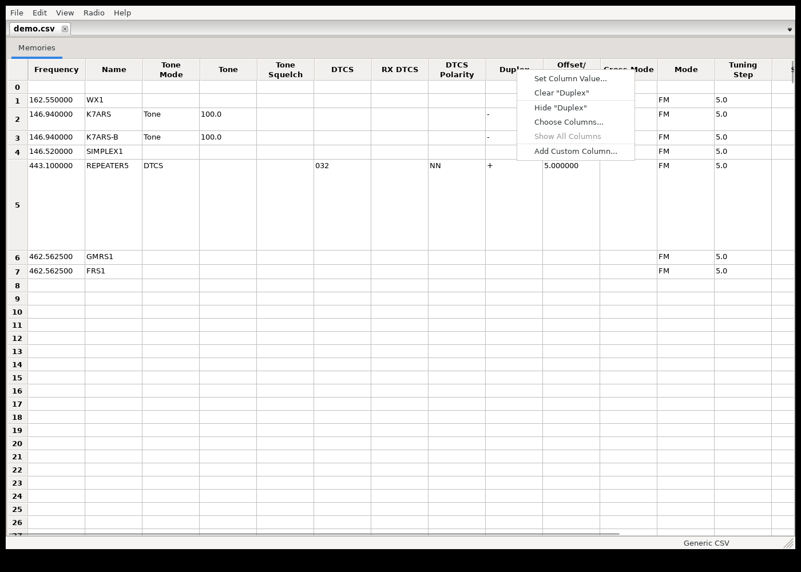
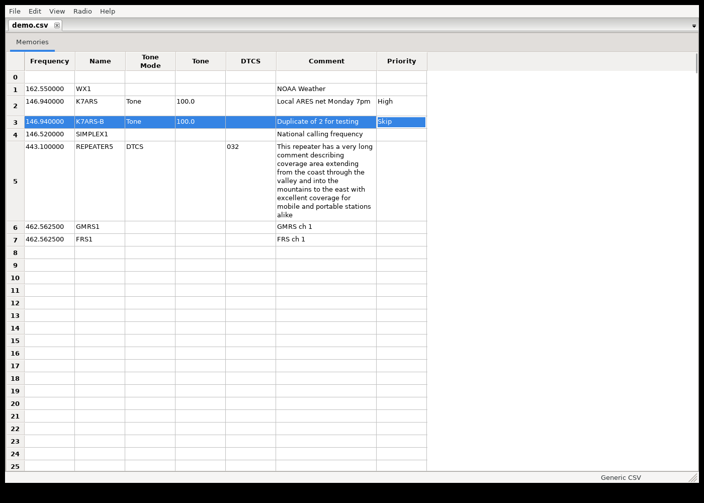
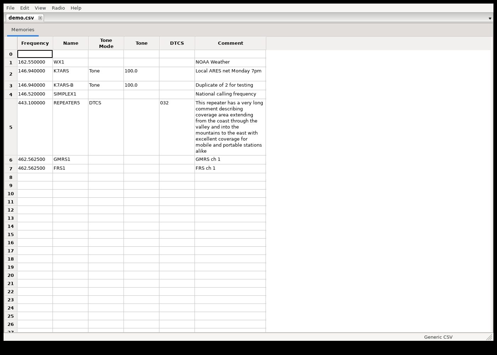
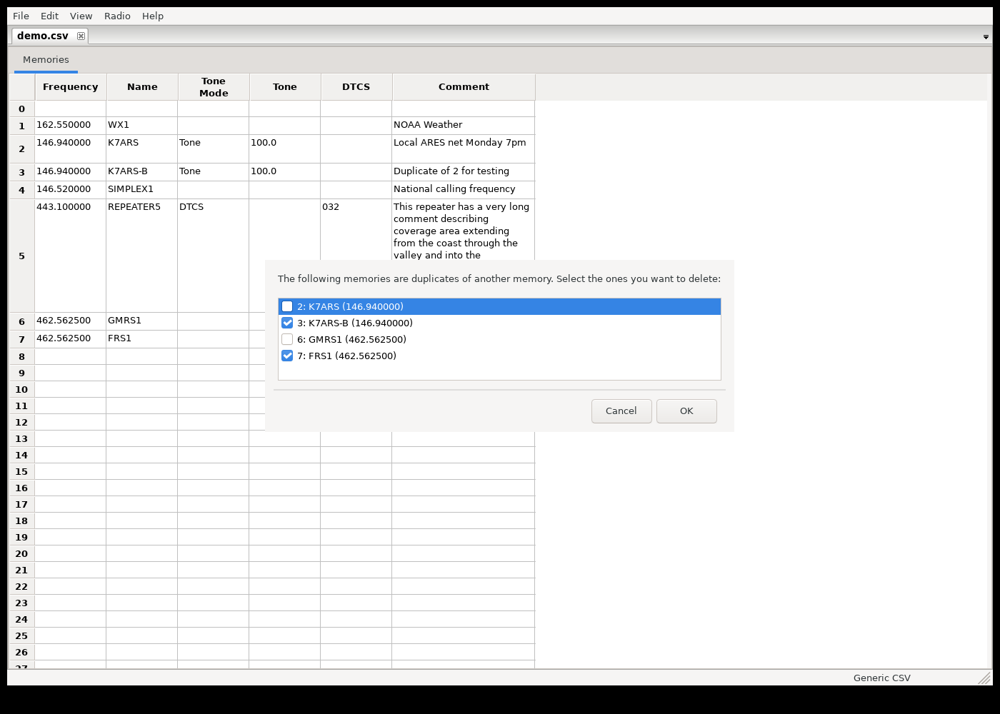
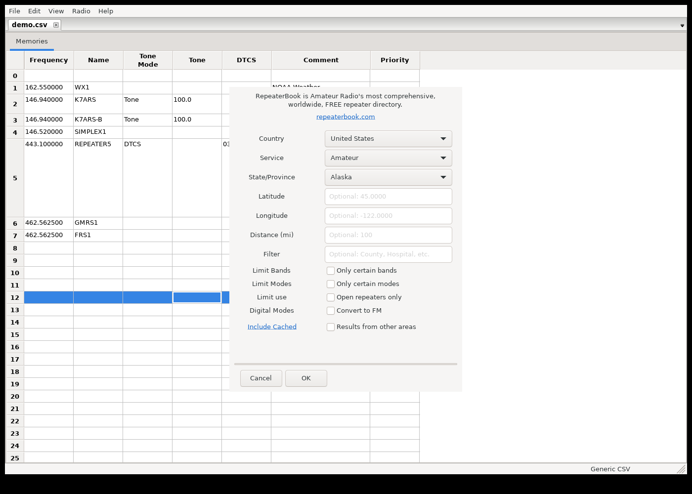

# CHIRP Project

This is the official git repository for the
__[CHIRP](https://www.chirpmyradio.com)__ project.

When submitting PRs, please see [this file](.github/pull_request_template.md)
for rules and guidelines.

## Features added in this fork

On top of upstream CHIRP, this fork adds several memory-editor
quality-of-life features, plus a convenience launcher script and Linux
AppImage packaging (see below).

### Column hiding, reordering, and custom columns

Right-click any memory list column header (or use View > Choose Columns...)
to hide columns you don't care about, or show columns that were previously
hidden. Columns can also be reordered by dragging their headers. Both the
hidden set and the order persist across sessions.

You can also add your own scratch column (View > Add Custom Column..., or
the header right-click menu) for personal notes, sorting, or triage — it's
session-only: not saved to the radio or the file, not validated, and not
part of undo. It disappears when the tab is closed.





### Word-wrapped Comment column

The Comment column wraps long text across multiple lines instead of
scrolling off as one long line, both when viewing and when editing in place
(View > Word-wrap Comment column to toggle). Rows grow individually to fit
their own comment.



### Find Duplicate Memories

Edit > Find Duplicate Memories... lets you choose which fields (frequency,
tone, offset, etc.) define a "duplicate," then shows the matching groups so
you can delete them — defaulting to keeping the lowest-numbered memory in
each group.



### Editable, savable network query results

Memories downloaded from a query source (RepeaterBook, RadioReference,
DMR-MARC, przemienniki.net/eu, mapy73.pl, Radio Amateur Satellites, SatNOGS)
used to be read-only with no way to save them — the only workaround was
exporting to CSV and reopening that file. They're now editable directly in
the grid, and saving an unsaved query result prompts for a CSV filename and
transparently swaps the tab to the newly-saved file.

### RepeaterBook distance in miles

The RepeaterBook query dialog's Distance field is now in miles (matching
RepeaterBook.com's own site and most of its US/Canada audience) instead of
kilometers; it's converted internally as needed. Other query sources
(przemienniki.net/eu) keep their km-based distance field.



### `run-chirp.sh`

A convenience launcher for running CHIRP straight from a git checkout: it
creates a local `.venv` (with access to system wxPython) on first run and
installs CHIRP into it, then launches `chirpwx.py`. See
[`run-chirp.sh`](run-chirp.sh).

## AppImage builds

This fork can produce a self-contained Linux AppImage of CHIRP, so people
with access to this repo can run it without setting up a Python/wxPython
build environment themselves.

**Getting a build:** every push of an `appimage-v*` tag (e.g. `appimage-v1`)
triggers the [AppImage workflow](.github/workflows/appimage.yml), which
builds the AppImage and attaches it to a matching
[GitHub Release](../../releases) on this repo. Download the
`CHIRP-*-x86_64.AppImage` asset from there, `chmod +x` it, and run it.

**Building one yourself:**

```
./appimage/build.sh
```

This must run on an x86_64 Ubuntu 22.04 (jammy) host — a real machine, VM,
or a `ubuntu:22.04` Docker container all work. It installs its own build
dependencies (via `sudo apt-get`) and writes the result to
`appimage/out/CHIRP-<version>-x86_64.AppImage`. You can also trigger a build
without tagging anything, via "Run workflow" on the
[Actions tab](../../actions/workflows/appimage.yml) (`workflow_dispatch`).

**Why it needs Ubuntu 22.04 specifically, and how it's built:** wxPython has
no portable Linux wheel on PyPI, so the recipe
([`appimage/AppImageBuilder.yml`](appimage/AppImageBuilder.yml), built with
[`appimage-builder`](https://appimage-builder.readthedocs.io/)) pulls
`python3-wxgtk4.0` and the GTK3 stack it depends on straight from Ubuntu
22.04's apt repositories, bundling them into the AppImage. CHIRP itself and
its pure-Python dependencies (`pyserial`, `requests`, `yattag`, `suds`,
`lark`) are then `pip install`ed on top into the same bundle, and
translations are compiled from `chirp/locale/*.po` directly into the
bundle (a step `pip install` alone skips, since it normally happens via
`chirp/locale/Makefile`).

This setup was built and verified end-to-end in a disposable Ubuntu 22.04
container: the resulting AppImage was launched under a virtual display
(Xvfb) and confirmed to fully initialize CHIRP's wx GUI
(`wx/4.0.7 gtk3 (phoenix) wxWidgets 3.0.5`), open its main window, check for
updates, and load a non-English translation correctly. A handful of shared
libraries (`libwayland-cursor0`, `libwayland-client0`, `libwayland-egl1`,
`libxcb-render0`) and build-time helper tools
(`gdk-pixbuf-query-loaders`, `glib-compile-schemas`, `gtk-update-icon-cache`)
had to be added explicitly, since apt's automatic dependency resolution
didn't pull them in on its own.

**Known limitations:** the build is x86_64-only and pinned to Ubuntu 22.04's
package versions (wxPython 4.0.7 / wxWidgets 3.0.5, GTK3). It has not been
tested on other architectures or against a Wayland compositor without the
X11 backend CHIRP forces by default on Linux.
